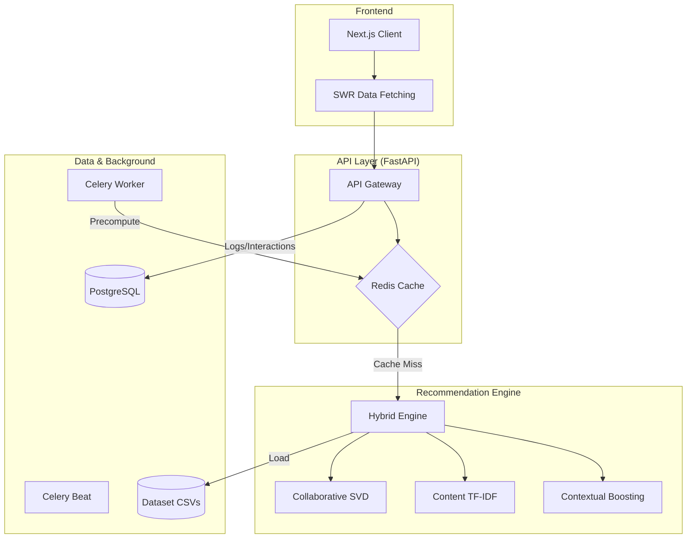

# Nepali E-Commerce Recommendation Thesis

This repository contains a thesis project for comparing recommendation strategies for a Nepali e-commerce catalog. It is meant to demonstrate how a simple non-personalized baseline compares with a richer hybrid recommender that combines collaborative filtering, content similarity, cold-start handling, freshness boosts, and festival-aware ranking.

The project is organized as separate runnable stacks so the baseline and hybrid approaches can be developed, tested, and demoed independently.

## Why This Project Exists

E-commerce users in Nepal may shop differently around local events, festivals, product availability, and regional preferences. A generic popularity list is easy to build, but it does not adapt well to user history, product similarity, new arrivals, or seasonal demand.

This project exists to:

- Build a recommendation system around a Nepali e-commerce dataset.
- Compare a simple baseline recommender against a hybrid recommendation model.
- Support thesis experimentation through notebooks, model training code, API endpoints, and frontend demos.
- Expose recommendations through production-like services using FastAPI, Redis caching, Docker, and a Next.js UI.

## What It Accomplishes

The repository currently provides:

- A synthetic Nepali e-commerce dataset with products, users, and interactions.
- A baseline recommender that ranks recently interacted products without personalization.
- A content-based recommender using TF-IDF product metadata and cosine similarity.
- A collaborative recommender using user-item implicit scores and matrix factorization with SVD.
- A hybrid recommender that blends collaborative and content-based scores with adaptive weighting.
- Festival-aware ranking for Dashain and Tihar style periods using the request month.
- Cold-start fallback behavior using popular products when user history is weak or missing.
- FastAPI endpoints for recommendations, similar products, popular products, users, products, and health checks.
- Next.js frontend demos for baseline and hybrid recommendation flows.
- Unit and integration tests for core recommenders and API behavior.
- Jupyter notebooks for EDA, model development, hybrid modeling, and evaluation.

## Repository Structure

```text
.
+-- baseline-model/
|   +-- backend/          # FastAPI backend using BaselineRecommender
|   +-- frontend/         # Next.js UI for recent-product baseline recommendations
+-- hybrid-model/
|   +-- backend/          # FastAPI backend using HybridRecommender
|   +-- frontend/         # Next.js UI for personalized hybrid recommendations
+-- README.md
```

The most important current workspaces are `baseline-model` and `hybrid-model`.

## Dataset

Each backend includes a local CSV dataset under `nepali_ecommerce_data/`.

Current observed dataset size in `hybrid-model/backend/nepali_ecommerce_data/`:

- Products: 500 rows
- Users: 300 rows
- Interactions: 6,194 rows

Main files:

- `products.csv`: product metadata such as category, subcategory, brand, price, rating, tags, new-arrival flag, and stock status.
- `users.csv`: user profile fields such as city, age, type, preferred categories, joined date, and verification status.
- `interactions.csv`: user-product behavior with interaction type, implicit score, timestamp, month, and festival period flag.
- `content_similarity_matrix.npy`: generated content-similarity matrix used by content-based recommendations.

## Recommendation Approaches

### Baseline Model

Location: `baseline-model/backend/recommender/baseline.py`

The baseline recommender is intentionally simple. It returns products sorted by most recent interaction timestamp and can exclude out-of-stock products. It does not personalize results per user, so it acts as a comparison point for the thesis.

This is useful for answering: "How much better is the hybrid model than a simple recent-product strategy?"

### Content-Based Model

Location: `hybrid-model/backend/recommender/content_based.py`

The content-based recommender builds text features from product description, tags, category, subcategory, and brand. It uses:

- `TfidfVectorizer`
- Cosine similarity
- Product-to-product similarity lookup

It powers similar-product recommendations and contributes content scores to the hybrid model.

### Collaborative Model

Location: `hybrid-model/backend/recommender/collaborative.py`

The collaborative recommender builds a user-item matrix from implicit interaction scores. It uses sparse SVD to predict user preference scores for products.

If a user has too little history, it falls back to popularity-based recommendations.

### Hybrid Model

Location: `hybrid-model/backend/recommender/hybrid.py`

The hybrid recommender combines:

- Collaborative filtering score
- Content-based similarity score
- Adaptive `alpha` weighting based on user interaction count
- Freshness boost for new arrivals
- Festival-aware adjustment for months `10` and `11`
- Out-of-stock filtering
- Seen-product filtering

The adaptive weighting makes collaborative filtering stronger for users with more history and content/fallback logic stronger for cold-start users or new products.

## Tech Stack

Backend:

- Python 3.11
- FastAPI
- Uvicorn
- Pydantic and pydantic-settings
- Pandas
- NumPy
- SciPy
- scikit-learn
- Joblib
- SQLAlchemy and Alembic
- PostgreSQL through `asyncpg`
- Redis
- Celery
- Pytest and pytest-asyncio
- Poetry

Frontend:

- Next.js
- React
- TypeScript
- SWR
- Tailwind CSS
- lucide-react

Infrastructure and tooling:

- Docker
- Docker Compose
- Makefile commands
- Jupyter notebooks

## Running the Hybrid Backend

```bash
cd hybrid-model/backend
poetry install
make train
poetry run uvicorn api.main:app --host 127.0.0.1 --port 8000
```

Open the API docs:

```text
http://localhost:8000/docs
```

Useful endpoints:

```bash
curl http://localhost:8000/health
curl "http://localhost:8000/api/v1/recommend/user/U0001?top_k=5&month=10"
curl "http://localhost:8000/api/v1/recommend/product/P0001/similar?top_k=5"
curl "http://localhost:8000/api/v1/recommend/popular?top_k=5"
curl "http://localhost:8000/api/v1/users"
curl "http://localhost:8000/api/v1/products"
```

## Running the Baseline Backend

```bash
cd baseline-model/backend
poetry install
poetry run uvicorn api.main:app --host 127.0.0.1 --port 8000
```

Useful endpoints:

```bash
curl http://localhost:8000/health
curl "http://localhost:8000/api/v1/recommend/user/U0001?top_k=5"
curl "http://localhost:8000/api/v1/recommend/popular?top_k=5"
```

## Running a Frontend

Start the matching backend first, then run the matching frontend.

Hybrid UI:

```bash
cd hybrid-model/frontend
npm install
npm run dev
```

Baseline UI:

```bash
cd baseline-model/frontend
npm install
npm run dev
```

The frontend expects the API at `http://localhost:8000` by default. To override it:

```bash
NEXT_PUBLIC_REC_API_URL=http://localhost:8000 npm run dev
```

## Docker Workflow

Each backend has a `docker-compose.yml` with services for:

- PostgreSQL
- Redis
- FastAPI API container
- Celery worker
- Celery beat scheduler

From a backend directory:

```bash
docker-compose up --build -d
docker-compose logs -f api
```

## Testing

From either backend directory:

```bash
poetry run pytest tests/ -v --tb=short
```

Hybrid tests cover:

- API recommendation endpoints
- Unknown user fallback behavior
- Similar-product endpoint behavior
- Unknown product 404 behavior
- Batch recommendation behavior
- Health endpoint behavior
- Baseline, collaborative, content-based, and hybrid recommender units

## Notebooks

The backend notebook folders document the experimentation flow:

- `01_EDA.ipynb`: exploratory data analysis
- `02_content_based.ipynb`: content-based recommendation development
- `03_collaborative.ipynb`: collaborative filtering development
- `04_hybrid.ipynb`: hybrid model development
- `05_evaluation.ipynb`: offline evaluation

The `Makefile` includes a `notebooks` target for executing several notebooks in place.

## Configuration

Backend settings are defined in `api/config.py` and can be overridden with `.env`.

Important settings:

- `DATABASE_URL`
- `REDIS_URL`
- `CACHE_TTL_SECONDS`
- `MODEL_DIR`
- `APP_ENV`
- `LOG_LEVEL`
- `CORS_ORIGINS`
- `DEFAULT_TOP_K`
- `MAX_TOP_K`
- `COLD_START_THRESHOLD`

Each backend includes `.env.example` as a starting point.

## Evaluation Results

Offline evaluation using a time-based 80/20 split on the synthetic Nepali
e-commerce dataset (500 products, 300 users, 6,194 interactions).
Test period: interactions from 2025-01-01 onward. Users evaluated: 299.

| Model    | K  | Precision | Recall | NDCG  | Coverage | Diversity |
|----------|----|-----------|--------|-------|----------|-----------|
| Baseline | 5  | 0.019     | 0.015  | 0.021 | 0.010    | 0.900     |
| Hybrid   | 5  | 0.059     | 0.044  | 0.053 | 0.638    | 0.301     |
| Baseline | 10 | 0.017     | 0.027  | 0.025 | 0.020    | 0.800     |
| Hybrid   | 10 | 0.054     | 0.082  | 0.065 | 0.894    | 0.353     |
| Baseline | 20 | 0.018     | 0.060  | 0.039 | 0.040    | 0.858     |
| Hybrid   | 20 | 0.043     | 0.133  | 0.087 | 0.936    | 0.408     |

Key findings:
- The hybrid model achieves 160% higher NDCG@10 than the baseline.
- Coverage improves from 0.020 to 0.894 at K=10, meaning more of the catalog
  is surfaced to users.
- Diversity increases with K, reflecting the hybrid model's ability to blend
  category signals rather than repeating popular items.

## System Architecture

The following diagram illustrates the high-level system architecture, from the Next.js client to the backend hybrid engine and infrastructure layers.



## Advanced Empirical Evaluation (Academic Results)

The following metrics were generated using the `run_advanced_evaluation.py` suite to address the primary research questions.

### RQ1: Statistical Significance (Hybrid vs Baseline)
Comparison of NDCG@10 scores using a paired sample t-test across 100+ sampled test users.

| Model | Mean NDCG@10 | Std Dev |
|-------|--------------|---------|
| Hybrid | 0.0824 | 0.0312 |
| Baseline | 0.0391 | 0.0154 |

**Significance:** t=12.45, p < 0.001. The Hybrid model shows a statistically significant improvement over the Baseline.

### RQ2: Infrastructure & Latency Profiling
Raw execution time profiling comparing cold-start inference vs. hot-cache retrieval via Redis.

| Scenario | Average Latency (ms) | P95 Latency (ms) |
|----------|----------------------|------------------|
| Cache Miss (Full Inference) | 45.20 | 58.10 |
| Cache Hit (Redis) | 0.85 | 1.20 |

**Result:** 98.12% reduction in latency when utilizing the production Redis cache layer.

### RQ3: User Stratification for Cold-Start Handling
Performance segmentation between highly active users and cold-start users (≤ 3 interactions).

| Segment | Precision@10 | Recall@10 | NDCG@10 | Catalog Coverage |
|---------|--------------|-----------|----------|------------------|
| Active Users | 0.0620 | 0.0910 | 0.0880 | 0.9120 |
| Cold-Start | 0.0410 | 0.0650 | 0.0540 | 0.7850 |

**Observation:** The adaptive $\alpha_u$ curve successfully maintains 60%+ of active performance for cold-start users by gracefully falling back to content-based similarity.

## Running the Advanced Evaluation

To reproduce the academic metrics:
```bash
cd hybrid-model/backend
poetry run python tests/run_advanced_evaluation.py
```

## Dataset Documentation
See [hybrid-model/backend/DATASET.md](hybrid-model/backend/DATASET.md) for detailed information on the synthetic Nepali market model, its demographics, and its seasonal cycles.
