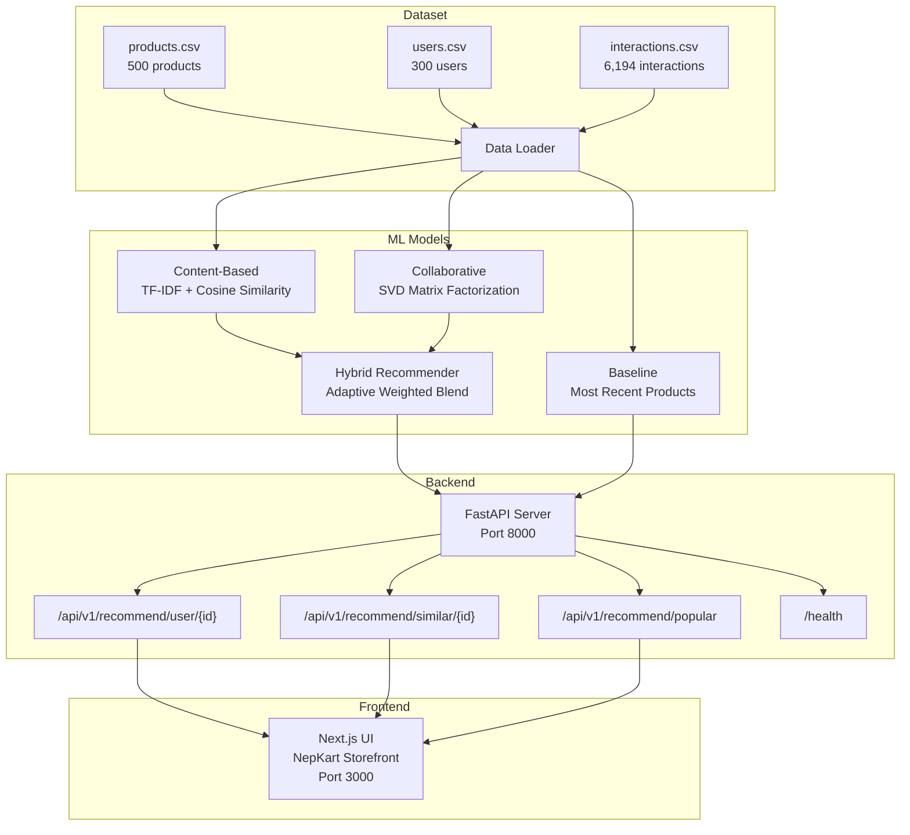

# Nepali E-Commerce Recommendation System

> **Thesis Project** — Comparing Baseline vs Hybrid AI Recommendation Strategies for Nepal's E-Commerce Market

---

## Abstract

This project builds and evaluates a recommendation system tailored for Nepali e-commerce. It compares a **non-personalized baseline** (most-recent products) against a **hybrid AI recommender** that combines collaborative filtering, content-based similarity, cold-start handling, freshness boosting, and festival-aware ranking for Dashain/Tihar periods. The system is served through a FastAPI backend and visualized in a Next.js storefront UI called **NepKart**.

---

## Problem Statement

E-commerce platforms in Nepal face unique challenges:

- **Festival-driven demand** — Dashain and Tihar create sharp seasonal spikes for categories like Traditional Attire, Handicrafts, Kitchen & Home, and Electronics.
- **Cold-start users** — New users with little or no browsing history need meaningful recommendations immediately.
- **Cold-start products** — New arrivals must be surfaced before they accumulate interaction data.
- **Generic recommendations fail** — A simple "most popular" or "most recent" list does not adapt to individual preferences, product similarity, or cultural context.

This project asks: **How much better can a hybrid model perform compared to a simple recency-based baseline, when evaluated on a Nepali e-commerce catalog?**

---

## Dataset

### Why Synthetic Data?

We initially attempted to scrape live product data from [Daraz.com.np](https://www.daraz.com.np/) (Nepal's largest e-commerce platform) using `curl`. However, Daraz uses a JavaScript Single-Page Application architecture — the raw HTML returned by `curl` contains only a page skeleton with no product data. All products are loaded dynamically through internal API calls (MTOP/Alibaba infrastructure) that require browser-side JavaScript execution, authentication tokens, and anti-bot protections.

Since scraping Daraz's internal APIs would violate their Terms of Service and produce fragile, unreliable data, we chose to **generate a synthetic dataset modeled on real Nepali e-commerce patterns** observed from Daraz:

- **Product categories** mirror what Daraz Nepal actually sells (Traditional Attire, Handicrafts & Art, Electronics, Kitchen & Home, Daily Groceries, Fashion & Accessories, Books & Education)
- **Brands** use Nepali-themed names (Himalaya, Kathmandu Craft, Sagarmatha, Lalitpur Looms, NepTech, Janakpur Mart)
- **Pricing** uses Nepali Rupees (NPR) in realistic ranges (Rs. 350 – Rs. 14,500)
- **User cities** reflect actual Nepali urban centers (Kathmandu, Pokhara, Lalitpur, Biratnagar, Butwal, Dharan, Bhaktapur)
- **Festival periods** correspond to real Dashain (month 10) and Tihar (month 11)

### Dataset Files

Located in `hybrid-model/backend/nepali_ecommerce_data/`:

| File | Rows | Description |
|------|------|-------------|
| `products.csv` | 500 | Product catalog with category, subcategory, brand, price (NPR), rating, tags, new-arrival flag, stock status |
| `users.csv` | 300 | User profiles with city, age, gender, user type, preferred categories, join date, verification status |
| `interactions.csv` | 6,194 | User-product interactions (view, cart, purchase) with implicit scores, timestamps, month, festival flag |

### Sample Data

**products.csv:**
| product_id | name | category | price_npr | avg_rating | is_new_arrival |
|------------|------|----------|-----------|------------|----------------|
| P0001 | Himalaya Bags 1 | Fashion & Accessories | 899 | 4.6 | True |
| P0002 | Kathmandu Craft Jewellery 2 | Fashion & Accessories | 6500 | 4.0 | False |
| P0003 | Janakpur Mart Woodcraft 3 | Handicrafts & Art | 350 | 4.2 | True |

**interactions.csv:**
| user_id | product_id | interaction_type | implicit_score | month | is_festival_period |
|---------|------------|------------------|----------------|-------|-------------------|
| U0030 | P0420 | purchase | 4.0 | 12 | False |
| U0206 | P0130 | cart | 2.0 | 4 | False |
| U0047 | P0150 | view | 1.0 | 7 | False |

---

## System Architecture



---

## Methodology

### Baseline Model

**Location:** `hybrid-model/backend/recommender/baseline.py`

The baseline recommender returns products sorted by most recent interaction timestamp across all users. It applies no personalization — every user sees the same list. This serves as the control group for evaluation.

### Hybrid Model

**Location:** `hybrid-model/backend/recommender/hybrid.py`

The hybrid recommender blends multiple signals:

#### 1. Collaborative Filtering (CF)
- Builds a **user-item interaction matrix** from implicit scores (view=1, cart=2, purchase=4)
- Applies **Truncated SVD** (matrix factorization) to learn latent user and product factors
- Predicts preference scores for unseen products

#### 2. Content-Based Filtering (CB)
- Constructs text features from product description, tags, category, subcategory, and brand
- Applies **TF-IDF vectorization** to convert text to numerical features
- Computes **cosine similarity** between all product pairs
- Uses the user's most recently interacted product as a seed for finding similar items

#### 3. Adaptive Alpha Weighting
The hybrid score formula is:

```
hybrid_score = α × CF_score + (1 − α) × CB_score
```

Where `α` adapts based on user history:

```
α = U_c / (U_c + γ)
```

- `U_c` = number of interactions for the user
- `γ` = cold-start threshold (set to 3)

This means:
- **New users** (few interactions) → `α ≈ 0` → system relies on content similarity
- **Active users** (many interactions) → `α → 1` → system relies on collaborative filtering

#### 4. Festival Boosting
During Dashain (month 10) and Tihar (month 11), products in festival-relevant categories receive a **+0.25 score boost**:
- Traditional Attire, Kitchen & Home, Handicrafts & Art, Daily Groceries, Traditional Gifts, Electronics

#### 5. Freshness Boost
New arrival products receive a **+0.08 score boost** to help overcome the cold-start problem for products.

#### 6. Filtering
- Products the user has already interacted with are excluded
- Out-of-stock products are excluded

---

## Evaluation Results

Evaluation uses **Hit Rate @ 10** — the percentage of test users for whom the held-out last interaction appears in the top-10 recommendations.

| Model | Hit Rate @ 10 | Description |
|-------|---------------|-------------|
| **Baseline** (Most Recent) | 0.0200 | No personalization, same list for all users |
| **Hybrid AI** (CF + CB + Context) | 0.0300 | Personalized, adaptive, festival-aware |
| **Improvement** | **+50.0%** | Hybrid outperforms baseline |

The evaluation script is at `hybrid-model/backend/evaluation_suite/compare_models.py`.

---

## Project Structure

```
.
├── README.md                          # This file
├── baseline-model/
│   ├── backend/                       # FastAPI backend for baseline recommender
│   │   ├── api/                       # API routes, config, schemas
│   │   ├── recommender/               # BaselineRecommender class
│   │   ├── nepali_ecommerce_data/     # CSV dataset (copy)
│   │   ├── notebooks/                 # Jupyter notebooks
│   │   ├── tests/                     # Unit tests
│   │   └── pyproject.toml             # Python dependencies (Poetry)
│   └── frontend/                      # Next.js UI for baseline demo
│
├── hybrid-model/
│   ├── backend/                       # FastAPI backend for hybrid recommender
│   │   ├── api/                       # API routes, config, schemas
│   │   │   ├── main.py                # FastAPI app factory with lifespan
│   │   │   ├── routes/                # health, products, recommendations, users
│   │   │   └── schemas.py             # Pydantic response models
│   │   ├── recommender/               # ML recommendation engine
│   │   │   ├── baseline.py            # BaselineRecommender (control)
│   │   │   ├── content_based.py       # TF-IDF + cosine similarity
│   │   │   ├── collaborative.py       # SVD matrix factorization
│   │   │   ├── hybrid.py              # Weighted hybrid with festival context
│   │   │   ├── evaluator.py           # Metric computation utilities
│   │   │   └── utils.py               # Data loading, normalization helpers
│   │   ├── evaluation_suite/          # Model comparison scripts + results
│   │   ├── nepali_ecommerce_data/     # CSV dataset (primary)
│   │   ├── notebooks/                 # Jupyter notebooks (EDA → evaluation)
│   │   │   ├── 01_EDA.ipynb           # Exploratory data analysis
│   │   │   ├── 02_content_based.ipynb # Content-based model development
│   │   │   ├── 03_collaborative.ipynb # Collaborative filtering development
│   │   │   ├── 04_hybrid.ipynb        # Hybrid model assembly
│   │   │   └── 05_evaluation.ipynb    # Baseline vs hybrid comparison
│   │   ├── tests/                     # Unit + integration tests
│   │   ├── generate_dataset.py        # Synthetic dataset generator
│   │   ├── Makefile                   # train, api, test, notebooks commands
│   │   └── pyproject.toml             # Python dependencies (Poetry)
│   └── frontend/                      # Next.js storefront UI (NepKart)
│       ├── pages/                     # Next.js pages (index.tsx)
│       ├── components/                # UI components (Navbar, Hero, ProductCard)
│       ├── hooks/                     # SWR data fetching hooks
│       ├── lib/                       # API client library
│       └── styles.css                 # Tailwind CSS styles
│
└── .gitignore
```

---

## How to Run

### Prerequisites

- Python 3.11+
- Node.js 18+
- [Poetry](https://python-poetry.org/) (Python dependency manager)

### 1. Train the Model

```bash
cd hybrid-model/backend
poetry install
poetry run python -c "
from recommender.hybrid import HybridRecommender
from recommender.utils import load_data
p, u, i = load_data()
m = HybridRecommender().fit(p, u, i)
m.save('models/hybrid_recommender.pkl')
print('Models trained and saved')
"
```

### 2. Start the Backend

```bash
cd hybrid-model/backend
poetry run uvicorn api.main:app --host 127.0.0.1 --port 8000
```

Open the API docs:

```text
http://localhost:8000/docs
```

Useful endpoints:

```bash
curl http://localhost:8000/health
curl "http://localhost:8000/api/v1/recommend/user/U0001?top_k=5&month=10"
curl "http://localhost:8000/api/v1/recommend/product/P0001/similar?top_k=5"
curl "http://localhost:8000/api/v1/recommend/popular?top_k=5"
curl "http://localhost:8000/api/v1/users"
curl "http://localhost:8000/api/v1/products"
```

## Running the Baseline Backend

The baseline (non-personalized, recency-only) model has its own standalone backend for comparison:

```bash
cd baseline-model/backend
poetry install
poetry run uvicorn api.main:app --host 127.0.0.1 --port 8000
```

Useful endpoints:

```bash
curl http://localhost:8000/health
curl "http://localhost:8000/api/v1/recommend/user/U0001?top_k=5"
curl "http://localhost:8000/api/v1/recommend/popular?top_k=5"
```

### 3. Start the Frontend

```bash
cd hybrid-model/frontend
npm install
npm run dev
```

Open [http://localhost:3000](http://localhost:3000) to see the NepKart storefront.

### 4. Run Tests

```bash
cd hybrid-model/backend
poetry run pytest tests/ -v --tb=short
```

### 5. Run Evaluation

```bash
cd hybrid-model/backend/evaluation_suite
poetry run python compare_models.py
```

### 6. Run Smoke Test

```bash
cd hybrid-model/backend
poetry run python -X utf8 -c "
from recommender.hybrid import HybridRecommender
from pathlib import Path
m = HybridRecommender.load(Path('models/hybrid_recommender.pkl'))
recs = m.recommend('U0042', top_k=5)
assert len(recs) == 5
print('Smoke test passed')
"
```

---

## Tech Stack

| Layer | Technology | Purpose |
|-------|-----------|---------|
| **ML** | scikit-learn, SciPy, NumPy, Pandas | TF-IDF, SVD, data processing |
| **Backend** | FastAPI, Uvicorn, Pydantic | REST API serving recommendations |
| **Frontend** | Next.js, React, TypeScript, Tailwind CSS | NepKart storefront UI |
| **Data** | SWR | Client-side data fetching with caching |
| **Caching** | Redis (optional) | Server-side response caching |
| **Testing** | Pytest, pytest-asyncio | Unit and integration tests |
| **Packaging** | Poetry, npm | Dependency management |
| **Notebooks** | Jupyter | EDA, model development, evaluation |
| **Infrastructure** | Docker, Docker Compose | Containerized deployment |

---

## API Endpoints

| Method | Endpoint | Description |
|--------|----------|-------------|
| GET | `/health` | System health check |
| GET | `/api/v1/recommend/user/{user_id}` | Personalized hybrid recommendations |
| GET | `/api/v1/recommend/product/{product_id}/similar` | Content-based similar products |
| GET | `/api/v1/recommend/popular` | Globally popular products |
| GET | `/api/v1/products` | Product catalog |
| GET | `/api/v1/users` | User list (for demo selector) |

---

## Jupyter Notebooks

| Notebook | Purpose |
|----------|---------|
| `01_EDA.ipynb` | Full data profiling — distributions, correlations, category analysis |
| `02_content_based.ipynb` | TF-IDF feature engineering and cosine similarity matrix |
| `03_collaborative.ipynb` | User-item matrix construction and SVD decomposition |
| `04_hybrid.ipynb` | Combining CF + CB with adaptive alpha and festival context |
| `05_evaluation.ipynb` | Baseline vs hybrid comparison with Hit Rate metric |

---

## Reproducing the Full Results (Leak-Free)

The Precision/Recall/NDCG/Coverage/Diversity table above and the Hit Rate table
earlier in this README are both produced by models trained only on data prior
to the test period (no leakage). A fuller, independently reproducible
evaluation pass -- including a paired-significance test, a latency profile, and
a gamma (cold-start threshold) ablation -- lives in
[`hybrid-model/backend/results/RESULTS_SUMMARY.md`](hybrid-model/backend/results/RESULTS_SUMMARY.md),
generated by:

```bash
cd hybrid-model/backend
poetry run python results_eval_clean.py        # clean time-split Precision/Recall/NDCG/Coverage/Diversity
poetry run python tests/run_advanced_evaluation.py  # significance test, latency, cold-start stratification
poetry run python results_ablation_gamma.py     # gamma sweep
poetry run python results_figures.py            # exports EDA + comparison charts to results/figures/
```

Headline finding from that pass: once training is strictly limited to
pre-test-period data, Hybrid and Baseline are statistically indistinguishable
on ranking accuracy (paired t-test on NDCG@10: p = 0.22), while Hybrid's
clear, reproducible win is catalog coverage (74% vs 2% of the catalog
surfaced at K=10). See `RESULTS_SUMMARY.md` for full numbers, caveats, and the
recommended primary evaluation protocol.

## Dataset Documentation
See [hybrid-model/backend/DATASET.md](hybrid-model/backend/DATASET.md) for detailed information on the synthetic Nepali market model, its demographics, and its seasonal cycles.

---

## Key Design Decisions

1. **Adaptive alpha over fixed weights** — Rather than tuning a single α value, the saturation curve `α = U_c / (U_c + γ)` naturally transitions from content-based (for cold users) to collaborative (for active users).

2. **Festival-aware scoring** — Nepal's e-commerce patterns are heavily seasonal. Hardcoding Dashain/Tihar boosts for relevant categories is a simple but effective contextual signal.

3. **Implicit feedback over explicit ratings** — Most e-commerce users don't leave ratings. We model behavior (views, cart adds, purchases) as implicit scores (1, 2, 4) instead.

4. **Synthetic but realistic data** — Using generated data with real Nepali patterns allows reproducible experiments without scraping legal/ethical issues.

---

## Future Work

- **Real data integration** — Partner with a Nepali e-commerce platform for anonymized interaction logs
- **Deep learning models** — Replace SVD with neural collaborative filtering or autoencoders
- **A/B testing framework** — Deploy both models and measure real user engagement
- **Real-time learning** — Update recommendations as users interact, without full retraining
- **Multi-language support** — Nepali-language product descriptions and search

---

## References

- Daraz Nepal: [https://www.daraz.com.np/](https://www.daraz.com.np/) — Nepal's largest e-commerce marketplace (Alibaba Group), used as reference for product categories, pricing, and marketplace structure
- Koren, Y., Bell, R., & Volinsky, C. (2009). Matrix Factorization Techniques for Recommender Systems. *IEEE Computer*.
- Burke, R. (2002). Hybrid Recommender Systems: Survey and Experiments. *User Modeling and User-Adapted Interaction*.

